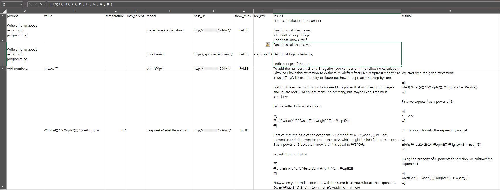
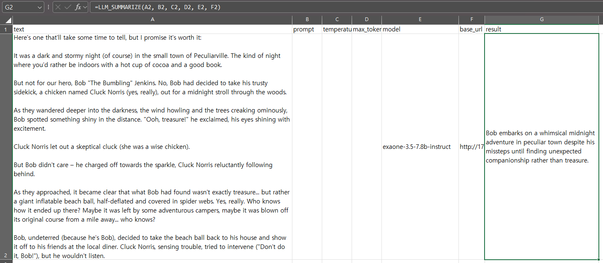
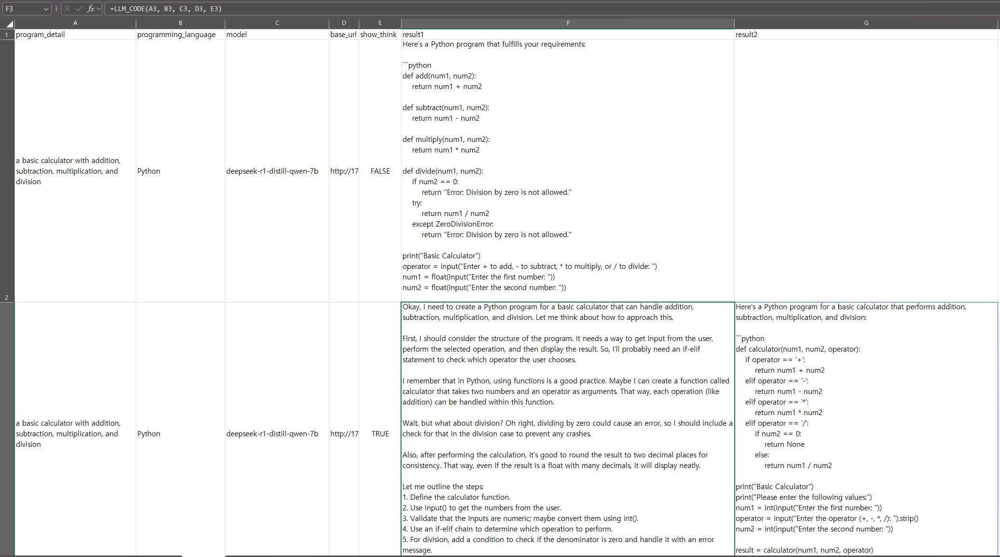
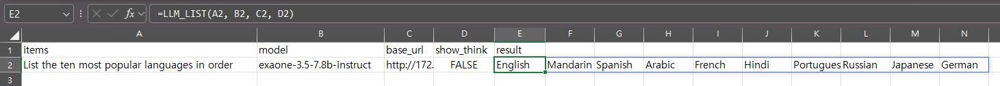
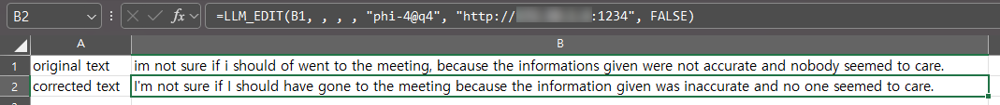

# xlsm-llm

Excel VBA functions for interacting with local and cloud-based LLMs, enabling text processing, translation, summarization, and code generation directly in Excel.  
These functions allow you to send prompts to LLMs and retrieve AI-generated responses directly in your spreadsheet, supporting both local models and external APIs like OpenAI, Gemini, and Upstage.

## Features  

xlsm-llm provides powerful Excel VBA functions that seamlessly integrate with local and external LLMs, enabling text processing, translation, summarization, and code generation directly within Excel.

**✨ Interact with LLMs directly in Excel**
- **LLM:** Send a prompt and receive AI-generated responses in your spreadsheet.
- **LLM_SUMMARIZE:** Automatically generate concise summaries of long texts.
- **LLM_CODE:** Generate code snippets in any programming language based on your requirements.
- **LLM_LIST:** Extract structured lists from AI responses for better data organization.
- **LLM_EDIT:** Improve text by fixing grammar, punctuation, and clarity.
- **LLM_TRANSLATE:** Translate text into different languages, with custom translation prompts available.

**⚡ Optimized for Ease of Use**
- Works with both **local LLMs and cloud APIs** (e.g., OpenAI, Gemini, Upstage).
- API keys can be provided **manually** or set as **environment variables** for seamless authentication.
- Functions handle **newline formatting** automatically, ensuring clean Excel outputs.

**✅ Reliable and Flexible**
- Supports **custom prompts** for greater control over AI-generated outputs.
- Includes **error handling** for stable and predictable function execution.
- Compatible with **various LLM models**, including GPT-based models, Upstage Solar, and locally hosted models.

With xlsm-llm, you can harness AI capabilities without leaving Excel, enhancing productivity and automation in text processing and coding tasks.

## Installation

1. **Clone the repository:**
   ```sh
   git clone https://github.com/ychoi-kr/xlsm-llm.git
   ```
2. **Import the VBA modules into your Excel workbook:**
   - Open your Excel workbook.
   - Press `Alt + F11` to open the Visual Basic for Applications (VBA) editor.
   - In the VBA editor, press `Ctrl + R` if the Project Explorer is not already visible. Locate your workbook's project (e.g., `VBAProject (YourWorkbookName.xlsm)`).
   - Right-click on your workbook's project in the Project Explorer and select **Import File…**.
   - Navigate to the `src` folder in the cloned repository, select the module file (for example, `LLM_Functions.bas`), and click **Open**.
   - The module should now appear in your Project Explorer.
3. **Add the required Microsoft XML reference:**
   - In the VBA editor, go to **Tools > References**.
   - Check **Microsoft XML, v6.0** from the list and click **OK**.

## Setting Environment Variables

Before using the functions, ensure that you have obtained an API key from your desired service provider (e.g., OpenAI, Gemini, Upstage, etc.). These keys allow you to authenticate with external LLM APIs. You can store these keys as environment variables so that the functions automatically use them when the API key parameter is omitted.

For example, if you are using the OpenAI API, set the environment variable `OPENAI_API_KEY`. Similarly, for Gemini or Upstage, you can set `GEMINI_API_KEY` or `UPSTAGE_API_KEY`, respectively.

- **On Windows:**  
  - Open **Control Panel > System > Advanced system settings > Environment Variables**.  
  - Under "User variables" (or "System variables" for all users), click **New…** and set the variable name (e.g., `OPENAI_API_KEY`) and the value as your API key.  
  - Alternatively, use the command prompt:  
    ```sh
    setx OPENAI_API_KEY your_api_key_here
    ```
- **On macOS/Linux:**  
  - Edit your shell profile (e.g., `~/.bash_profile` or `~/.zshrc`) and add a line such as:  
    ```sh
    export OPENAI_API_KEY=your_api_key_here
    ```  
  - Then reload your profile by running `source ~/.bash_profile` (or the appropriate command for your shell).

This method works for any API key required by the functions; just replace `OPENAI_API_KEY` with the appropriate variable name for the service you are using (e.g., `GEMINI_API_KEY`, `UPSTAGE_API_KEY`).

## Using a Local LLM

You can use `xlsm-llm` with a **local LLM** instead of a cloud-based API (e.g., OpenAI, Gemini, Upstage). To do this, you need to **set up and run a local LLM server**.  

The easiest way to run a local LLM is with **[LM Studio](https://lmstudio.ai/)**:  

1. **Download and install LM Studio** from [lmstudio.ai](https://lmstudio.ai/).  
2. **Download a model** – LM Studio suggests recommended models upon first launch, or you can browse and install a model of your choice.  
3. **Start the local server** in the **Local Server** tab.  
4. **Set the `base_url` in Excel functions** to match the server’s address (e.g., `http://localhost:1234/v1/`).  
5. **Specify the model explicitly** when calling the function, as local LLMs require a model name.  

For example:  
```
=LLM("Write a haiku", "recursion in programming", 0.7, 100, "qwen2.5-14b-instruct", "http://localhost:1234/v1/")
```

💡 **No API key is required** for most local LLMs.  

For detailed setup instructions, refer to the [LM Studio documentation](https://lmstudio.ai/docs).

## Usage

### LLM
This function sends a prompt to your local LLM server and returns the processed response. You can either let the function use the API key stored in your environment variable or provide one directly as the last parameter.

**Example format:**
```
=LLM(prompt, [value], [temperature], [max_tokens], [model], [base_url], [show_think], [api_key])
```
If you omit the `api_key` argument, the function will automatically use the API key stored in the relevant environment variable (e.g., `OPENAI_API_KEY` for OpenAI API).



> **Note:** If the response includes line breaks, you may need to enable text wrapping in the cell. To do this, right-click the cell, select **Format Cells**, go to the **Alignment** tab, and check **Wrap Text**.

### LLM_SUMMARIZE
LLM_SUMMARIZE processes the input text to produce a succinct summary. It is ideal for quickly condensing lengthy texts.

**Example format:**
```
=LLM_SUMMARIZE(text, [prompt], [temperature], [max_tokens], [model], [base_url], [show_think], [api_key])
```


### LLM_CODE
LLM_CODE generates code based on the provided program details and programming language. This function is perfect for automating code snippet creation.

**Example format:**
```
=LLM_CODE(program_detail, programming_language, [model], [base_url], [show_think], [api_key])
```


### LLM_LIST
LLM_LIST creates a list of items using a specified prompt. The output is formatted using special tags, ensuring consistency in the list's presentation.

**Example format:**
```
=LLM_LIST(prompt, [model], [base_url], [show_think], [api_key])
```


### LLM_EDIT
LLM_EDIT refines a sentence by correcting grammar, punctuation, and overall clarity. By default, it uses the prompt:  
`Please correct the following sentence for clarity, grammar, and punctuation:`  
However, you can supply a custom prompt to tailor the editing process to your needs.

**Example format:**
```
=LLM_EDIT(text, [prompt], [temperature], [max_tokens], [model], [base_url], [show_think], [api_key])
```


### **LLM_TRANSLATE**  

Translates text into a specified language. You can provide a **custom translation prompt** for more control over the output.  

**Example:**  
```
=LLM_TRANSLATE(A1, "es")
```
➡ Translates the text in **A1** into Spanish.  

If a **custom prompt** is provided, `targetLang` and `sourceLang` are ignored:  
```
=LLM_TRANSLATE(A1, , , "Translate this text using formal language.")
```

For **local LLMs**, specify `base_url` and `model`:  
```
=LLM_TRANSLATE(A1, "ja", , , , , "qwen2.5-14b-instruct", "http://localhost:1234/v1/")
```

📖 **For detailed usage, visit:**  
🔗 [LLM_TRANSLATE Wiki Page](https://wikidocs.net/276821)

### **LLM_REVIEW_TRANSLATION**  

Evaluates a translation by comparing it to the original text, providing feedback on **accuracy, grammar, fluency, and overall quality**. You can specify a **focus area** (e.g., "fluency", "technical terminology") for targeted review.  

**Example:**  
```
=LLM_REVIEW_TRANSLATION(A1, B1, "fluency")
```
➡ Reviews the translation in **B1** with a focus on fluency, comparing it to the original text in **A1**.  

Works with **both local and cloud-based LLMs**. For local models, specify `base_url` and `model`:  
```
=LLM_REVIEW_TRANSLATION(A1, B1, , , , "qwen2.5-14b-instruct", "http://localhost:1234/v1/")
```

📖 **For detailed usage, visit:**  
🔗 [LLM_REVIEW_TRANSLATION Wiki Page](https://wikidocs.net/276819)

## License

This project is licensed under the MIT License.
