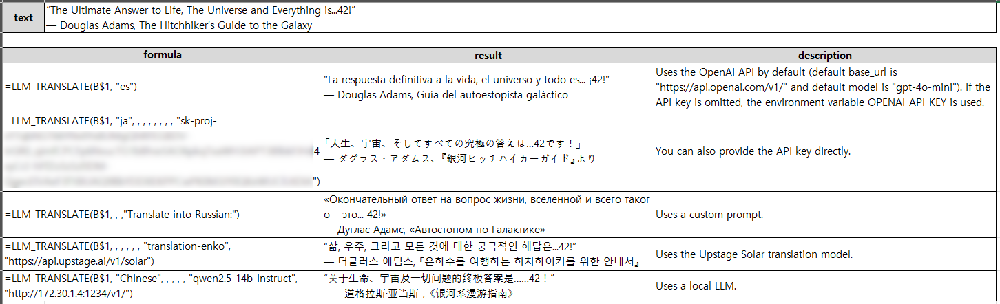

# xlsm-llm

Excel VBA functions utilizing local LLMs.

This repository provides a set of Excel VBA modules that integrate with local language model (LLM) servers. It allows you to send prompts and receive processed text (e.g., summaries, code generation, text correction) directly into Excel, complete with error handling and proper formatting.

## Features

- **LLM**: Sends a prompt to the LLM server and returns a processed response.
- **LLM_SUMMARIZE**: Generates a concise summary of a given text using the LLM.
- **LLM_CODE**: Produces code based on provided requirements and the specified programming language.
- **LLM_LIST**: Creates a formatted list of items using specific output tags.
- **LLM_EDIT**: Improves a sentence by correcting grammar, punctuation, and clarity.
- **LLM_TRANSLATE**: Translates text from one language to another, with flexible usage based on the translation model.
- Modularized helper functions:
  - **BuildJsonPayload**: Constructs the JSON payload for the API request.
  - **SendLLMRequest**: Sends HTTP requests with detailed error reporting.
  - **ExtractContent**: Uses regex to extract the response content without trailing noise.
- Automatic newline conversion for proper cell formatting.
- **API Key Support**: Each function accepts an optional API key (as the last parameter) that allows you to authenticate with external LLM APIs (such as OpenAI, Gemini, Upstage, etc.). You can also store your API key in an environment variable (e.g., `OPENAI_API_KEY`, `GEMINI_API_KEY`, or `UPSTAGE_API_KEY`) so that it is used automatically when the API key parameter is omitted.

## Installation

1. **Clone the repository:**
   ```sh
   git clone https://github.com/ychoi-kr/xlsm-llm.git
   ```
2. **Import the VBA modules into your Excel workbook:**
   - Open your Excel workbook.
   - Press `Alt + F11` to open the Visual Basic for Applications (VBA) editor.
   - In the VBA editor, press `Ctrl + R` if the Project Explorer is not already visible. Locate your workbook's project (e.g., `VBAProject (YourWorkbookName.xlsm)`).
   - Right-click on your workbook's project in the Project Explorer and select **Import File…**.
   - Navigate to the `src` folder in the cloned repository, select the module file (for example, `LLM_Functions.bas`), and click **Open**.
   - The module should now appear in your Project Explorer.
3. **Add the required Microsoft XML reference:**
   - In the VBA editor, go to **Tools > References**.
   - Check **Microsoft XML, v6.0** from the list and click **OK**.

### Setting Environment Variables

Before using the functions, ensure that you have obtained an API key from your desired service provider (e.g., OpenAI, Gemini, Upstage, etc.). These keys allow you to authenticate with external LLM APIs. You can store these keys as environment variables so that the functions automatically use them when the API key parameter is omitted.

For example, if you are using the OpenAI API, set the environment variable `OPENAI_API_KEY`. Similarly, for Gemini or Upstage, you can set `GEMINI_API_KEY` or `UPSTAGE_API_KEY`, respectively.

- **On Windows:**  
  - Open **Control Panel > System > Advanced system settings > Environment Variables**.  
  - Under "User variables" (or "System variables" for all users), click **New…** and set the variable name (e.g., `OPENAI_API_KEY`) and the value as your API key.  
  - Alternatively, use the command prompt:  
    ```sh
    setx OPENAI_API_KEY your_api_key_here
    ```
- **On macOS/Linux:**  
  - Edit your shell profile (e.g., `~/.bash_profile` or `~/.zshrc`) and add a line such as:  
    ```sh
    export OPENAI_API_KEY=your_api_key_here
    ```  
  - Then reload your profile by running `source ~/.bash_profile` (or the appropriate command for your shell).

This method works for any API key required by the functions; just replace `OPENAI_API_KEY` with the appropriate variable name for the service you are using (e.g., `GEMINI_API_KEY`, `UPSTAGE_API_KEY`).

**Note:** If you are only using a local LLM, API keys are generally not necessary, so you can skip this step.

## Usage

### LLM
This function sends a prompt to your local LLM server and returns the processed response. You can either let the function use the API key stored in your environment variable or provide one directly as the last parameter.

**Example format:**
```
=LLM(prompt, [value], [temperature], [max_tokens], [model], [base_url], [show_think], [api_key])
```
If you omit the `api_key` argument, the function will automatically use the API key stored in the relevant environment variable (e.g., `OPENAI_API_KEY` for OpenAI API).


### LLM_SUMMARIZE
LLM_SUMMARIZE processes the input text to produce a succinct summary. It is ideal for quickly condensing lengthy texts.

**Example format:**
```
=LLM_SUMMARIZE(text, [prompt], [temperature], [max_tokens], [model], [base_url], [show_think], [api_key])
```


### LLM_CODE
LLM_CODE generates code based on the provided program details and programming language. This function is perfect for automating code snippet creation.

**Example format:**
```
=LLM_CODE(program_detail, programming_language, [model], [base_url], [show_think], [api_key])
```


### LLM_LIST
LLM_LIST creates a list of items using a specified prompt. The output is formatted using special tags, ensuring consistency in the list's presentation.

**Example format:**
```
=LLM_LIST(prompt, [model], [base_url], [show_think], [api_key])
```


### LLM_EDIT
LLM_EDIT refines a sentence by correcting grammar, punctuation, and overall clarity. By default, it uses the prompt:  
`Please correct the following sentence for clarity, grammar, and punctuation:`  
However, you can supply a custom prompt to tailor the editing process to your needs.

**Example format:**
```
=LLM_EDIT(text, [prompt], [temperature], [max_tokens], [model], [base_url], [show_think], [api_key])
```


### LLM_TRANSLATE
LLM_TRANSLATE translates text from one language to another using your LLM. The simplest usage requires only the text and the target language. You can also provide a custom translation instruction if desired.

- **General Usage:**  
  In the simplest case, you specify the text to be translated and the target language. Optionally, you can include the source language and/or a custom prompt. When a custom prompt is provided, both the `targetLang` and `sourceLang` parameters are ignored.
  
  **Format:**
  ```
  =LLM_TRANSLATE(text, targetLang, [sourceLang], [customPrompt], [temperature], [maxTokens], [model], [base_url], [show_think], [api_key])
  ```
  
  For example, to translate "Hello, world!" into Spanish:
  ```
  =LLM_TRANSLATE("Hello, world!", "es")
  ```
  
  And to use a custom translation instruction (which ignores `targetLang` and `sourceLang`):
  ```
  =LLM_TRANSLATE(text, [targetLang ignored], [sourceLang ignored], customPrompt, [temperature], [maxTokens], [model], [base_url], [show_think], [api_key])
  ```

- **Upstage API Exception:**  
  When using Upstage API's `translation-enko` or `translation-koen` models, the function ignores the `targetLang`, `sourceLang`, and `customPrompt` parameters, using only the input text for translation.
  
  **Format:**
  ```
  =LLM_TRANSLATE(text, [targetLang ignored], [sourceLang ignored], [customPrompt ignored], [temperature], [maxTokens], [model], [base_url], [show_think], [api_key])
  ```
  


## License

This project is licensed under the MIT License.
